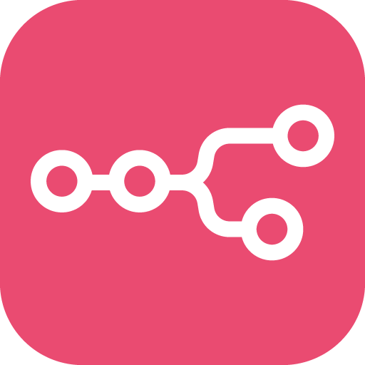
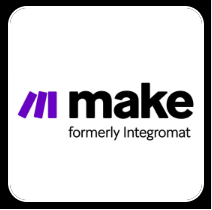
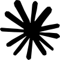

  

<!-- Profile Header (Name and Titles) -->

  <h1 style="font-size: 24px; margin-bottom: 5px;">
    Jothirmoy Sarker Shuvo
    <!-- Badge Icons -->
    
    
    
  </h1>

  

    AI & Data Science undergraduate with published research in LLM hallucination reduction, cybersecurity topic modeling, and healthcare analytics using Machine Learning & Deep Learning. Currently working as an AI Automation Engineer at Softvence Delta, building end-to-end automation systems using n8n, Zapier, Make, OpenAI, Anthropic Claude, and Google Gemini APIs. Passionate about Large Language Models, AI workflow automation, NLP, and scalable intelligent systems that solve real-world business problems.
  

- Building AI automation systems using **n8n, Zapier, Make, OpenAI, Claude, and Gemini APIs**.
- Researching **LLMs, NLP, hallucination reduction, and AI workflow optimization**.
- Developing intelligent applications with **Python, SQL, Deep Learning, and Machine Learning**.
- Delivering client-focused automation solutions and scalable AI integrations.

# Skill 

<h3 align="left">Artificial Intelligence & Machine Learning:</h3>

  - **Computer Vision:** CNN, Transfer learning, GAN. 
  - **Machine Learning:** Naive Bayes, Logistic Regression, SVM, Decision Trees, KNN.
  - **Neural Network:** LSTM, RNN, GRU.

<h3 align="left">AI Automation & LLM Systems:</h3>

  - **AI Automation:** n8n, Zapier, Make (Integromat).
  - **Large Language Models:** Ollama, OpenAI, Gemini, Qwen, DeepSeek. 
  - **NLP & Transformers:** BERT, Self-Attention, Text Classification. 
  - **Deployment & Integration:** FastAPI, Model APIs, Workflow Automation.
 
# Research Papers

<h3 align="left">Hallucination Reduction in Large Language Models</h3>

- Designed a claim-level hallucination detection and correction framework for LLMs.
- Applied atomic claim extraction with self-evaluation and consistency checking.
- Used belief graphs and preference based fine-tuning to improve factual accuracy.

<h3 align="left">Unveiling Cybersecurity Research Topics: A HybridTopic Modeling Framework</h3>

- Analyzed 2,300+ cybersecurity papers (2005–2025).
- Applied LDA, K-Means, Hybrid, and BERTopic.
- Compared models using coherence and clustering metrics.

# Languages, Frameworks & Tools
 

    
    
     

 

###

<h3 align="left">AI Automation & LLM Systems:</h3>

  
  
  
   
  
  

###

  
  
  

###

<picture>
  <source media="(prefers-color-scheme: dark)" srcset="https://raw.githubusercontent.com/jothirmoysarker/jothirmoysarker/pacman-output/pacman-contribution-graph-dark.svg">
  <source media="(prefers-color-scheme: light)" srcset="https://raw.githubusercontent.com/jothirmoysarker/jothirmoysarker/pacman-output/pacman-contribution-graph.svg">
  
</picture>

###

  

